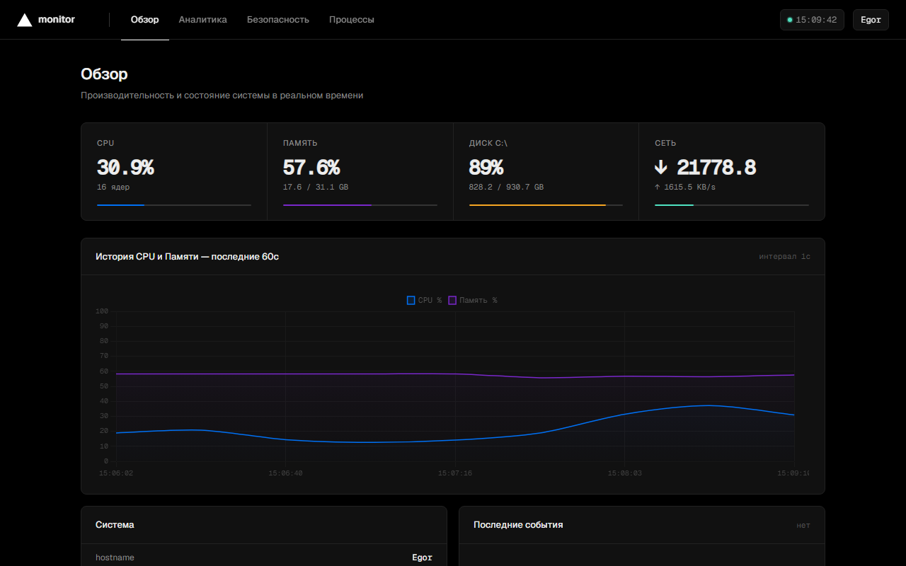
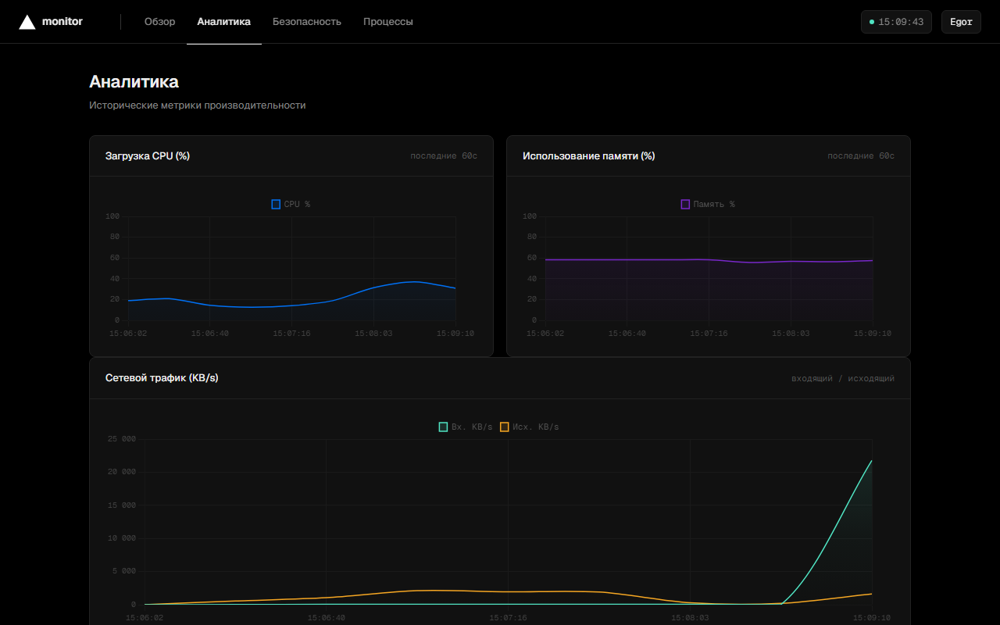
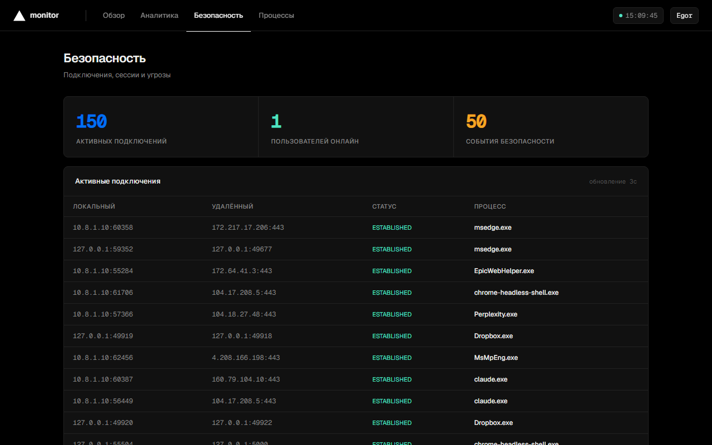
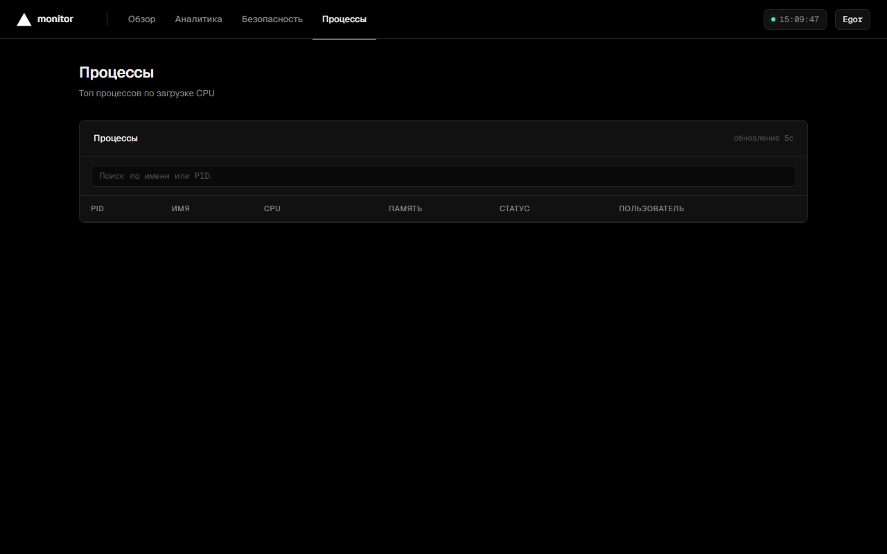

# server-monitor


Мониторинг сервера через браузер. CPU, RAM, диск, сеть и процессы в реальном времени.

## Интерфейс



<details>
<summary>Ещё скрины</summary>





</details>

## Запуск

**Linux / macOS**
```bash
git clone https://github.com/Laincetta/server-monitor.git
cd server-monitor
./run.sh
```

**Windows**
```bat
git clone https://github.com/Laincetta/server-monitor.git
cd server-monitor
run.bat
```

**Docker**
```bash
docker compose up -d
```

Открыть: http://localhost:5000

Скрипты сами создадут виртуальное окружение и установят зависимости.

## Что показывает

- CPU, RAM, диск, сеть — обновляется раз в секунду
- Графики нагрузки за последние 60 секунд
- Процессы отсортированы по CPU, с поиском по имени
- Новые подключения, сессии пользователей, подозрительные процессы

## Конфигурация

Скопируй `.env.example` в `.env` и настрой под себя:

```env
MONITOR_PORT=5000
THRESHOLD_CPU_CRIT=85
THRESHOLD_RAM_CRIT=90
THRESHOLD_DISK_CRIT=90
```

## API

| Endpoint | Что возвращает |
|---|---|
| `GET /api/metrics` | CPU, RAM, диск, сеть + история 60с |
| `GET /api/alerts` | Оповещения о превышении порогов |
| `GET /api/security` | События безопасности |
| `GET /api/connections` | Активные сетевые соединения |
| `GET /api/processes` | Топ 30 процессов по CPU |
| `GET /health` | Статус для балансировщика / Docker |

## Стек

Python · Flask · psutil · Chart.js · Waitress

## Лицензия

[MIT](LICENSE)
